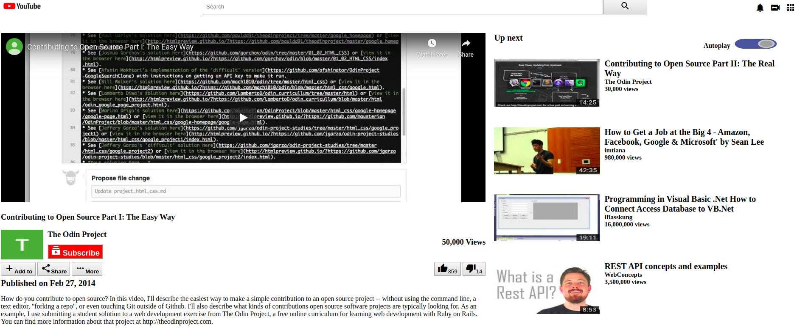

# Youtube Video Player Page

> This first Microverse project is based on the Embedding Images and Video section in the Curriculum which entails created a clone of the YouTube Video Player Page.

In this project, the major features are: 1. An embedded Video Player 2. A side-bar with recommended Videos 3. A search bar 4. Like and share buttons

## Built With

- HTML5 and CSS
- Materialize Icons

## Authors

👤 **Author1**

- Github: [@Azeem838](https://github.com/Azeem838)

👤 **Author2**

- Github: [@Hillarioh](https://github.com/hillarioh)

## 🤝 Contributing

Contributions, issues and feature requests are welcome!

Feel free to check the [issues page](https://github.com/Azeem838/Youtube-Video-Player-Page/issues).

## Show your support

Give a ⭐️ if you like this project!

## 📝 License

This project is [MIT](lic.url) licensed.
